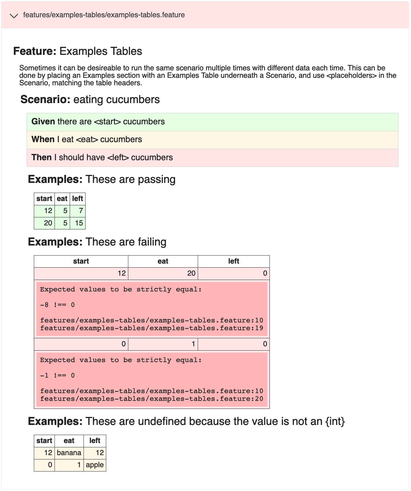

# Cucumber-React

Cucumber-React is a set of React components for rendering Gherkin documents and Cucumber results.

## Screenshot



## Usage

The source code for screenshots above is:

```jsx
<Wrapper envelopes={envelopes}>
  <GherkinDocumentList />
</Wrapper>
```

The [`<GherkinDocumentList>`](src/components/app/GherkinDocumentList.tsx) React component,
is an accordion of [`<GherkinDocument>`](src/components/gherkin/GherkinDocument.tsx).

The `<GherkinDocument>` React component and any component nested within it (such as [`<Scenario>`](src/components/gherkin/Scenario.tsx)) can be rendered standalone.

## `<GherkinDocument>` features

The `<GherkinDocument>` React component is instantiated with a single `gherkinDocument` prop.
The value must be a [GherkinDocument](../../cucumber-messages/messages.md#io.cucumber.messages.GherkinDocument) object.
You can use the [Gherkin](../../gherkin) parser to generate a `GherkinDocument` object.

By default the `<GherkinDocument>` component will not display any coloured results, as the `GherkinDocument`
message object does not contain results, only the [AST](https://en.wikipedia.org/wiki/Abstract_syntax_tree) of the document. 
This is fine for simple use cases where results are not important.

To render a `<GherkinDocument>` with results and highlighted [Cucumber Expression parameters](https://cucumber.io/docs/cucumber/cucumber-expressions/) parameters it must be nested inside a 
[`<Wrapper>`](src/components/app/Wrapper.tsx) component.

## Build / hack

Install dependencies

    npm install

Run tests

    npm test

Interactive development

    npm run storybook

## Ideas

### `ScenarioList` component

A component that renders a list of scenarios (possibly from multiple files, filtered by e.g. tag). 

This component could be used to render relevant scenarios in 3rd-party tools, such as 
JIRA, Confluence and various issue trackers that support plugins.

### Link to JIRA

Configure with a regexp and url function, and tags will be rendered as JIRA issue links

### Search

Search by tag, but also by text. Could use http://elasticlunr.com/
or https://lunrjs.com/ - or it could simply perform filtering on an array of `GherkinDocument` messages.

### Search results

Each scenario displayed underneath each other, grouped by feature file. The feature description is "collapsed", 
(unless it contains the search term) but can be opened.

### Filtering / sorting

* by tag
* by duration (find slow ones)
* by status
* by recency (update timestamp) - exclude old ones
* by flickeriness

### Tag search

* Render a tag cloud for all tags
  * Size: count
  * Color: pass/fail/undefined
    
### On-demand data

For large reports (especially with screenshots) it may be too heavy to store it all in the browser.
The GUI should request data for the current document on demand. The GUI should also be able to filter
what kind of events it wants. For example, to render the initial screen.

### Server / App

It should be easy to use. Just run the app (Electron). It will create a named pipe where
it will listen. What's written here gets written straight to the React app (no websocket,
it's in the same process). This app can be fairly small.

### Rerun tests

Add a message to represent a config+cwd+env for a run, so the GUI can rerun it.
The config is essentially command line options. They can be modified in the gui.
Rerun on file change can also be set up. This just makes the whole DX simple.

### Alerts

The app could use the OS to send screen messages (autotest like)

